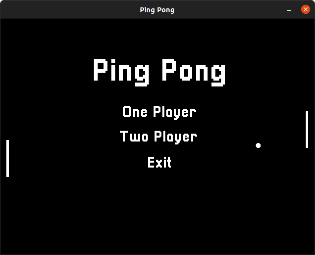

# Ping Pong

  

## Description
Ping Pong, made in C++ using SFML

## Requirements
* C++14
* CMake 3.0.0
* SFML 2

## Credits
* Sounds - [captaincrunch80](https://opengameart.org/content/3-ping-pong-sounds-8-bit-style)
* Music - [Jan125](https://opengameart.org/content/artblock)
* Font - [Zacchary Dempsey-Plante](https://www.dafont.com/pixellari.font)
